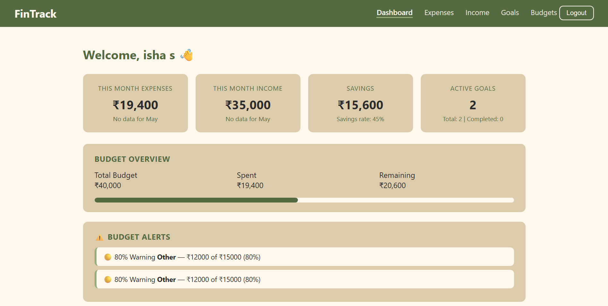
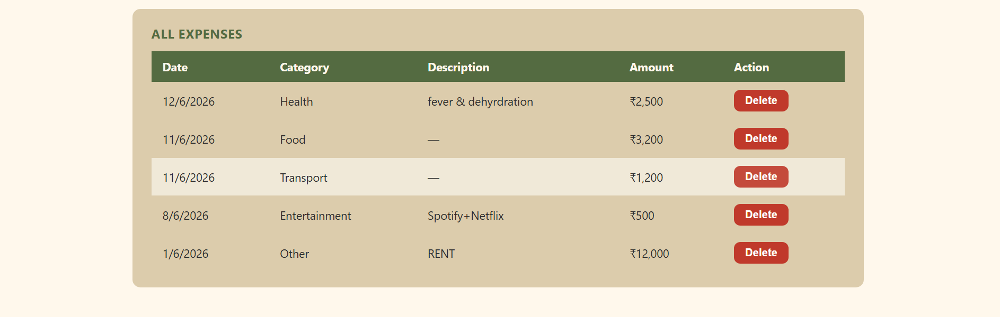
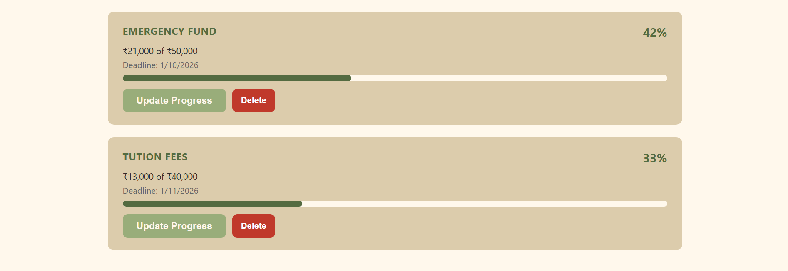
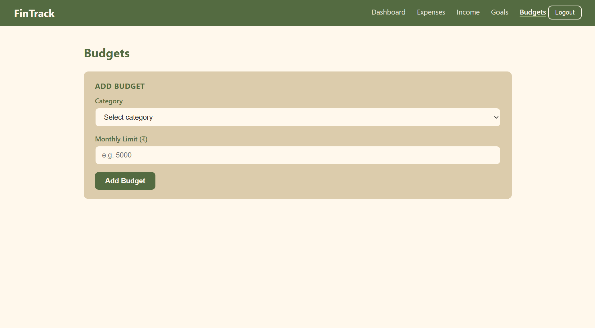

"# FinTrack" 
# FinTrack

A personal finance management web app to track expenses, income, goals and budgets — with smart insights and predictions.



## Screenshots





## Features

- User authentication (Register/Login)
- Expense tracking with categories
- Income tracking
- Goal planning with progress tracking
- Budget management with breach alerts
- Budget prediction & overspend warnings
- Monthly analytics & insights
- Smart dashboard with month-on-month comparisons

## Tech Stack

**Backend:** Node.js, Express.js, MongoDB, Mongoose, JWT

**Frontend:** HTML, CSS, JavaScript

## Getting Started

### Prerequisites
- Node.js
- MongoDB Atlas account

### Installation

1. Clone the repo
```bash
   git clone https://github.com/ishkiee/fintrack.git
   cd fintrack/server
```

2. Install dependencies
```bash
   npm install
```

3. Create `.env` file in `/server`:

4. Run the server
```bash
   node server.js
```

5. Open `client/login.html` in your browser

## API Endpoints

| Module | Method | Endpoint |
|---|---|---|
| Auth | POST | /api/auth/register |
| Auth | POST | /api/auth/login |
| Expenses | GET/POST/DELETE | /api/expenses |
| Income | GET/POST/PUT/DELETE | /api/income |
| Goals | GET/POST/PUT/DELETE | /api/goals |
| Budgets | GET/POST/PUT/DELETE | /api/budgets |
| Dashboard | GET | /api/dashboard |
| Analytics | GET | /api/analytics/monthly |
| Analytics | GET | /api/analytics/categories |
| Predictions | GET | /api/predictions/budget |
| Goal Prediction | GET | /api/goals/predict/:id |

## Project Structure
## Project Structure

```text
track_finance/
├── client/
│   ├── css/
│   ├── login.html
│   ├── register.html
│   ├── dashboard.html
│   ├── expenses.html
│   ├── income.html
│   ├── goals.html
│   └── budgets.html
├── screenshots/
├── server/
│   ├── config/
│   ├── controllers/
│   ├── middleware/
│   ├── models/
│   ├── routes/
│   └── server.js
└── README.md
```